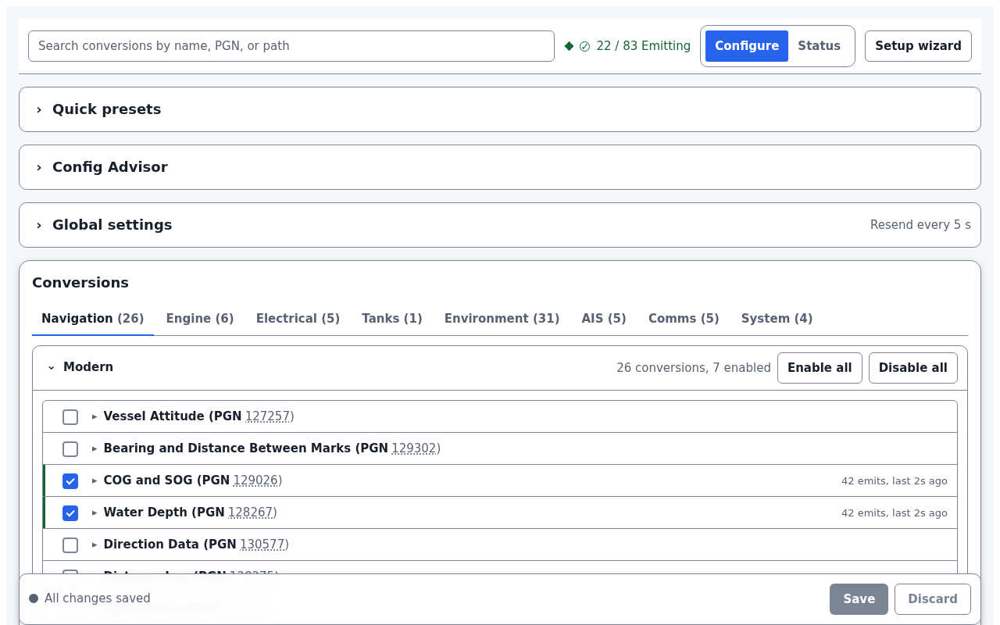
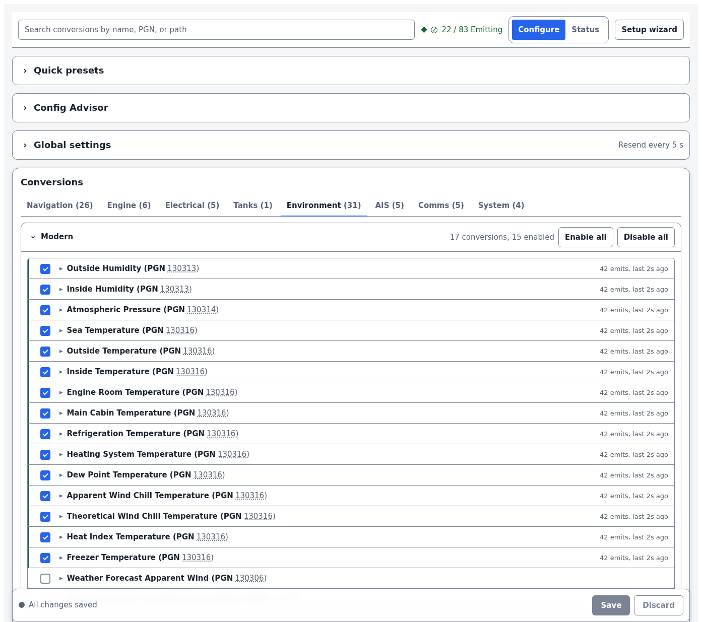
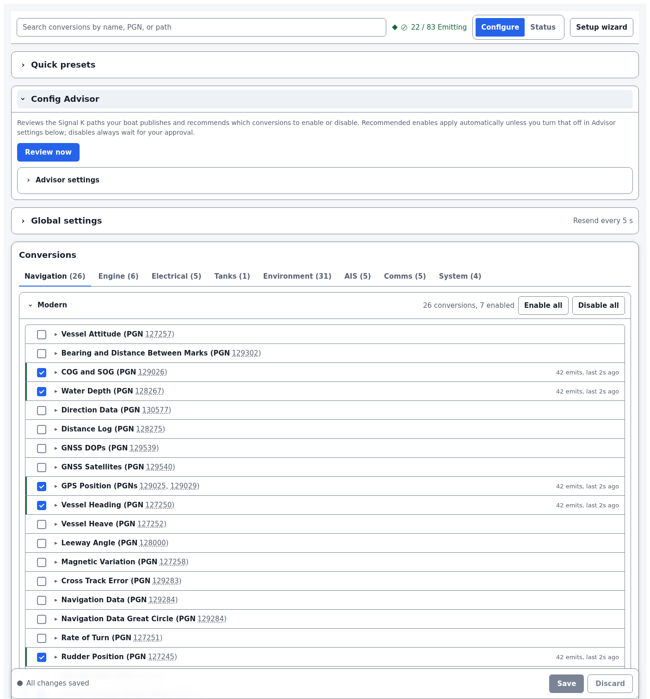

# NMEA 2000 Emitter Cannon

[](https://www.npmjs.com/package/signalk-nmea2000-emitter-cannon)
[](https://www.npmjs.com/package/signalk-nmea2000-emitter-cannon)
[](https://github.com/NearlCrews/signalk-nmea2000-emitter-cannon/actions/workflows/ci.yml)
[](https://github.com/NearlCrews/signalk-nmea2000-emitter-cannon/actions/workflows/plugin-ci.yml)
[](https://github.com/NearlCrews/signalk-nmea2000-emitter-cannon/blob/main/LICENSE)
[](https://nodejs.org)
[](https://www.buymeacoffee.com/nearlcrews)

A [Signal K](https://signalk.org) plugin that converts Signal K deltas into
NMEA 2000 messages: 46 conversion modules covering 53 data PGNs, aligned with
Garmin ECHOMAP, GPSMAP, and GMI specifications and the canboatjs encoder.

> Built on the foundation of [`signalk-to-nmea2000`](https://github.com/SignalK/signalk-to-nmea2000)
> by Scott Bender and the Signal K community.

## What's new in 1.7.3

- **Config panel works before the plugin is enabled.** A freshly installed
  plugin showed every conversion category with a `(0)` count and nothing to
  configure; the panel now loads the full catalog of all 75 conversions
  whether or not the plugin has been enabled yet.
- **Root cause.** signalk-server mounts a plugin's API routes at load but only
  calls `start()` once the plugin is enabled, so the catalog endpoint had no
  running plugin manager and returned an empty list at the one moment the
  catalog is needed: choosing conversions to save and enable.
- **Manager-independent catalog.** The conversion-to-metadata mapping moved
  into a shared `buildConversionMetadata()` helper feeding one catalog provider
  used by both the API router and the Config Advisor, so each serves the live
  catalog when the plugin is running and a standalone copy otherwise.

No breaking changes; the test suite grows to 142 tests. See the
[v1.7.3 changelog entry](CHANGELOG.md#v173) and the
[full release history](CHANGELOG.md).

## What it does

Signal K is an open marine data standard that streams a boat's navigation,
environment, and electrical data over a single API. NMEA 2000 Emitter Cannon
closes the loop in the other direction: it subscribes to the Signal K paths
your boat publishes and re-emits them as NMEA 2000 PGNs through the server's
NMEA 2000 output, so chartplotters, instrument displays, and autopilots on
the bus see data that originates in Signal K (a weather plugin, a non-NMEA
sensor, a computed value) as native bus traffic.

Every conversion is verified round-trip through the canboatjs encoder, and
PGN priorities, SID fields, and enum values are aligned with Garmin's
published specifications. It pairs well with sensor-side plugins such as
[`signalk-virtual-weather-sensors`](https://github.com/NearlCrews/signalk-virtual-weather-sensors).

## Features

- **46 conversion modules emitting 53 data PGNs**, plus 5 bus-layer PGNs
  (59392, 59904, 60928, 126993, 126996) advertised in the 126464 transmit list
- **Garmin-aligned** PGN priorities, SID fields, temperature-source enum
  values, and wind and bearing reference enums verified against the Garmin
  ECHOMAP UHD2 6/7/9 sv Owner's Manual
- **Reactive subscriptions** via RxJS 7.8 with debounced multi-key aggregation
  and per-key freshness timeouts
- **Source filtering** per conversion: pick a specific `$source` label or
  accept any
- **Resend timers** per conversion plus a global default, so MFDs that expect
  periodic re-broadcast still see the data when the underlying source is quiet
- **Config Advisor** (optional): reviews the Signal K paths your boat
  publishes, recommends which conversions to enable or disable, and flags
  enabled conversions whose pinned `$source` has gone stale (a renamed weather
  provider or a re-enumerated sensor), with optional QuestDB history
- **A React configuration panel** with dense one-line conversion rows, a
  single-open inline editor, a compact sticky toolbar carrying catalog search
  and live status, category tabs with per-category Enable all and Disable all,
  preset chips, a first-run setup wizard, and a theme toggle with light, dark,
  and a red-preserving night mode
- **`$source: 'NMEA2000'` echo guard** on AIS conversions to avoid re-emitting
  received AIS deltas back onto the bus
- **Strict TypeScript**, pure ESM, a single esbuild bundle with RxJS as the
  only runtime dependency
- **Embedded canboatjs round-trip tests** on every conversion module, plus
  advisor, lifecycle, and panel unit tests (140 tests across 14 files)

## Screenshots

| Conversion config | Environment category | Config Advisor |
| :---: | :---: | :---: |
| [](assets/screenshots/config-panel.png) | [](assets/screenshots/environment-conversions.png) | [](assets/screenshots/config-advisor.png) |

## Requirements

- [Signal K server](https://github.com/SignalK/signalk-server) 2.x. The React
  config panel loads on every signalk-server 2.x admin UI.
- Node.js 22.12 or newer.
- A supported NMEA 2000 gateway (for example an Actisense NGT-1 or a Yacht
  Devices YDNR-02) connected so emitted messages reach the bus.

## Installation

Install from the Signal K admin UI under **AppStore, then Available**, or
from npm:

```bash
cd ~/.signalk
npm install signalk-nmea2000-emitter-cannon
```

From source:

```bash
git clone https://github.com/NearlCrews/signalk-nmea2000-emitter-cannon.git
cd signalk-nmea2000-emitter-cannon
npm install
npm run build
ln -s "$(pwd)" ~/.signalk/node_modules/signalk-nmea2000-emitter-cannon
```

## Configuration

In the Signal K admin UI, open **Server, then Plugin Config**, find
"NMEA 2000 Emitter Cannon", and enable the plugin. The plugin ships a React
config panel that the Signal K admin loads via webpack 5 Module Federation.
The panel has these areas:

1. **Sticky toolbar**: catalog search, a condensed status chip (NMEA 2000
   output readiness, count of enabled vs total conversions, a stale-poll
   marker, and a jump-to-error button), the Configure and Status toggle, the
   theme toggle, and the Setup wizard shortcut. It stays pinned as you scroll.
2. **Config Advisor** (optional, collapsed by default): reviews the Signal K
   paths your boat publishes, recommends which conversions to enable or
   disable, and flags enabled conversions whose pinned `$source` has gone
   stale. Its settings sub-panel covers QuestDB history and a periodic review
   schedule, each control with inline help.
3. **Preset chips** (collapsed by default): Basic Navigation, Engine Set, Full
   AIS, Environmental, Raymarine. Click a chip to enable the tagged conversions
   in one action; presets are additive.
4. **Global resend interval** (seconds, collapsed by default): default cadence
   for every conversion whose own resend is 0. Default `5`; set to `0` to
   disable global resend.
5. **Category tabs** (Navigation, Engine, Electrical, Tanks, Environment, AIS,
   Comms, System), each listing its conversions as dense one-line rows with
   per-category Enable all and Disable all controls. The toolbar's catalog
   search filters by title, PGN number, and Signal K path across all
   categories.

Each conversion row shows an enable checkbox, the title and PGN run, a
compatibility badge, an error glyph, and the emit recency, with a left status
rail that reads solid when the conversion is emitting and dotted when it is
enabled but silent. Clicking a row opens its editor inline below it (opening
another row closes the previous one), exposing a per-conversion **Resend**
override, a **Source filter** dropdown (populated live from the server's data
model), and a **Mapping editor** on conversions that need an explicit Signal K
identifier to NMEA 2000 instance mapping (`BATTERY`, `ENGINE_PARAMETERS`,
`EXHAUST_TEMPERATURE`, `TANKS`, `SOLAR`, `RAYMARINE_BRIGHTNESS`,
`NOTIFICATIONS`, `TEMPERATURE_*`).

The config panel loads on any signalk-server 2.x admin UI. v1.4.x config
payloads migrate transparently the first time the panel loads them.

## Documentation

- [PGN reference](docs/pgn-reference.md): all 53 data PGNs, modules, and the
  Garmin recommendations
- [Troubleshooting](docs/troubleshooting.md)
- [Development guide](docs/development.md)
- [Changelog](CHANGELOG.md)
- [Contributing](.github/CONTRIBUTING.md)
- [Security policy](.github/SECURITY.md)

## Development

This project targets Node 22.12 or newer, with TypeScript 6 and Biome
(development only). canboatjs is exercised in the test suite and bundled
into the build, not installed at runtime.

```bash
git clone https://github.com/NearlCrews/signalk-nmea2000-emitter-cannon.git
cd signalk-nmea2000-emitter-cannon
npm install
npm run hooks        # one-time: enable the pre-commit hook
npm run build        # esbuild plugin bundle plus webpack panel
npm test             # Vitest suite (140 tests)
npm run typecheck    # type-check the plugin, the panel, and the tests
npm run check        # full Biome check
npm run lint         # Biome linting only
npm run format       # Biome auto-format
```

Run `npm run check`, `npm run typecheck`, and `npm test` before committing.
See the [development guide](docs/development.md) for the full workflow.

## License

Apache-2.0: see [LICENSE](LICENSE) for the full text. The software is
provided "AS IS", without warranty of any kind. Data this plugin places on
the NMEA 2000 bus is advisory: always carry independent means of navigation
and verify against your primary instruments.

## Acknowledgments

Built on the foundation of [`signalk-to-nmea2000`](https://github.com/SignalK/signalk-to-nmea2000)
by Scott Bender and the Signal K community. Full credit to the original
authors for the conversion framework and PGN implementations. NMEA 2000
Emitter Cannon is written and maintained by
[Nearl Crews](https://github.com/NearlCrews).

- [Signal K Project](https://signalk.org/) for the open marine data standard
- [Canboat Project](https://github.com/canboat/canboat) for the NMEA 2000
  protocol implementation that the canboatjs encoder is built on

NMEA 2000 Emitter Cannon pairs well with sibling plugins such as
[`signalk-virtual-weather-sensors`](https://github.com/NearlCrews/signalk-virtual-weather-sensors),
[`signalk-openrouter-companion`](https://github.com/NearlCrews/signalk-openrouter-companion),
and [`signalk-crows-nest`](https://github.com/NearlCrews/signalk-crows-nest).

## Support

Find this plugin useful? You can support its continued development by
[buying me a coffee](https://www.buymeacoffee.com/nearlcrews).

- [Report a bug](https://github.com/NearlCrews/signalk-nmea2000-emitter-cannon/issues/new?template=bug_report.yml)
- [Request a feature](https://github.com/NearlCrews/signalk-nmea2000-emitter-cannon/issues/new?template=feature_request.yml)
- [Security issues](.github/SECURITY.md)
